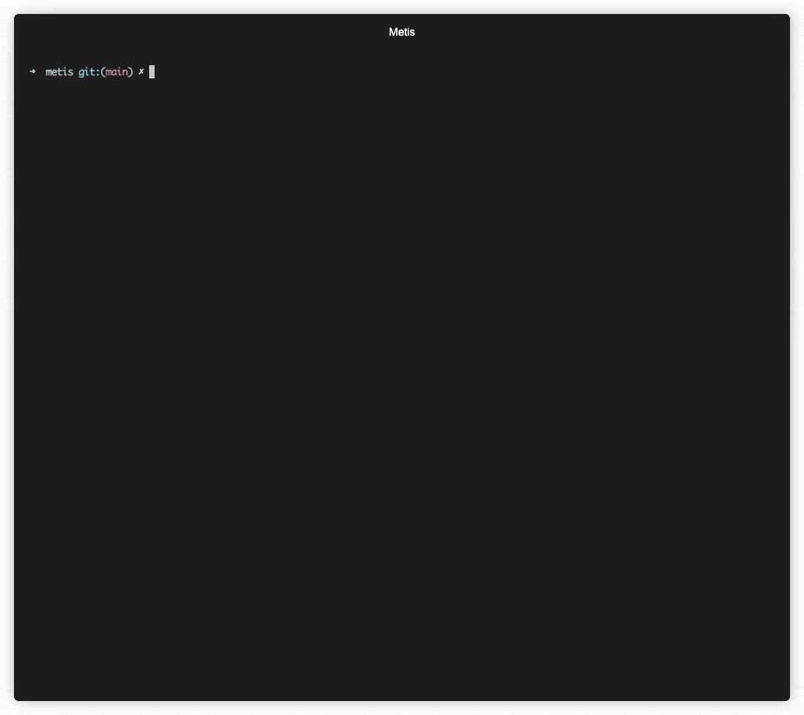

# Metis: AI-Powered Security Code Review

[](https://pre-commit.com/)
[](https://github.com/psf/black)
[](https://python.org)
[](https://securityscorecards.dev/viewer/?uri=github.com/arm/metis)
[](https://www.bestpractices.dev/projects/10876)
[](LICENSE)


Metis is an open-source, AI-driven tool for deep security code review, created by [Arm's Product Security Team](https://www.arm.com/products/product-security). It helps engineers detect subtle vulnerabilities, improve secure coding practices, and reduce review fatigue. This is especially valuable in large, complex, or legacy codebases where traditional tooling often falls short.

The tool is named after **Metis**, the Greek goddess of wisdom, deep thought and counsel.

## Features

- **Deep Reasoning**
  Unlike linters or traditional static analysis tools, Metis doesn’t rely on hardcoded rules. It uses LLMs capable of semantic understanding and reasoning.

- **Context-Aware Reviews**
	RAG ensures that the model has access to broader code context and related logic, resulting in more accurate and actionable suggestions.

- **Plugin-Friendly and Extensible**
  Designed with extensibility in mind: support for additional languages, models, and new prompts is straightforward.

Metis currently supports C and C++, python, and rust via a plugin-based language system, making it easy to extend to additional languages.

It also supports multiple vector store backends, including PostgreSQL with pgvector and ChromaDB. It currently integrates a single language model provider (OpenAI), but is designed to support additional providers in the future.



## Getting Started

By default, Metis uses **ChromaDB** for local, no-setup usage. You can also use **PostgreSQL (with pgvector)** for scalable indexing and multi-project support.

### 1. **Installation**

After cloning the repository, you can either create a virtual environment or install dependencies system-wide.

To use a virtual environment (recommended):

```bash
uv venv
uv pip install .
```

or install system wide using --system:

```bash
uv pip install . --system
```

To install with **PostgreSQL (pgvector)** backend support:

```bash
uv pip install '.[postgres]'
```

### 2. **Set up LLM Provider**

**OpenAI**

Export your OpenAI API key before using Metis:

```bash
export OPENAI_API_KEY="your-key-here"
```

### 3. Index and Run Analysis

Run metis by also providing the path to the source you want to analyse:

```
uv run metis --codebase-path <path_to_src>
```

Then, index your codebase using:
```
index
```
Finally, run the security analysis across the entire codebase with:
```
review_code
```
## Configuration

**Metis Configuration (`config.yaml`)**

Metis uses a YAML configuration file located at the project root (typically `config.yaml`). This file defines all runtime parameters including:

- **LLM provider:** OpenAI model names, embedding models, token limits
- **Engine behavior:** max workers, max token length, similarity top-k
- **Database connection:** In the case of PostgreSQL: host, port, credentials, and schema name
- **Vector indexing:** HNSW parameters for `pgvector`

This file is **required** to run Metis and should be customized per deployment.

**Prompt Configuration (`plugins.yaml`)**

Metis uses a `plugins.yaml` file to define language-specific behavior, including LLM prompt templates and document splitting logic.
Each language plugin (e.g., C) references this file to load:

### Prompt Templates
You can customize a number of prompts like the following prompts:

- `security_review`: Guides the LLM to perform a security audit of code or diffs.
- `validation_review`: Asks the LLM to assess the correctness or quality of a generated review.
- `security_review_checks`: A list of all the security issues the LLM will try to search for.

These prompts provide natural language context for the LLM and can be tailored to your use case (e.g., stricter audits, privacy reviews, compliance).

### Code Splitting Parameters
You can also configure the chunking parameters for source code and documentation:

- `chunk_lines`: Number of lines per chunk
- `chunk_lines_overlap`: Overlap between chunks
- `max_chars`: Max characters per chunk

## Running Metis

Metis provides an interactive CLI with several built-in commands. After launching, you can run the following:

### `index`
Indexes your codebase into a vector database. Must be run before any analysis.

### `review_code`
Performs a full security review of the indexed codebase.

### `review_file <path>`
Performs a targeted security review of a single file.

### `review_patch <patch.diff>`
Reviews a diff/patch file and highlights potential security issues introduced by the change.

### `update <patch.diff>`
Incrementally updates the index using a diff. Avoids full reindexing.

### `ask <question>`
Ask Metis anything about the indexed codebase. Useful for exploring architecture, identifying design patterns, or clarifying logic.

## Running in Non-Interactive Mode

Metis also supports a non-interactive mode, useful for automation, CI/CD pipelines, or scripted usage.

To use Metis in non-interactive mode, use the --non-interactive flag along with --command:

```bash
metis --non-interactive --command "<command> [args...]" [--output-file <file.json>]
```

## Examples

#### Example 1: Chroma (default)

```bash
metis --codebase-path <path_to_src>  --language-plugin python
```

#### Example 2: Postgres

If you prefer not to use the default ChromaDB backend, you can switch to PostgreSQL either using a local installation or the provided Docker setup.

To get started quickly, run:

```bash
docker compose up -d
```

This will launch a PostgreSQL instance with the pgvector extension enabled, using the credentials specified in your `docker-compose.yml`.

Then, run Metis with the PostgreSQL backend:

```bash
metis \
  --project-schema myproject_main \
  --codebase-path <path_to_src> \
  --language-plugin c \
  --backend postgres
```

#### Example 3: Usage and output


```bash
> review_file src/memory/remap.c
```

Vulnerable source code:
```c
// Remap memory addresses from one region to another
for (uint32_t* ptr = start; ptr < end; ptr++) {
    uint32_t value = *ptr;
    if (value >= OLD_REGION_BASE && value < OLD_REGION_BASE + REGION_SIZE) {
        value = value - OLD_REGION_BASE + NEW_REGION_BASE;
    }
}
```

Example output:

```bash
File: src/memory/remap.c
Identified issue 1: Address Remapping Loop Does Not Update Memory
Snippet:
for (uint32_t* ptr = start; ptr < end; ptr++) {
    uint32_t value = *ptr;
    if...
Why: In the remap_address_table function, the code is intended to adjust address references from an old memory region to a new one. However, the updated value stored in the local variable 'value' is never written back into memory at the pointer location (*ptr). This means the address entries remain unchanged, which can lead to unintended behavior if the system relies on those values being relocated correctly.
Mitigation: Update the loop so that after computing the new address, the value is written back. For example:
for (uint32_t* ptr = start; ptr < end; ptr++) {
    uint32_t value = *ptr;
    if (value >= OLD_REGION_BASE && value < OLD_REGION_BASE + REGION_SIZE) {
        value = ((value - OLD_REGION_BASE) + NEW_REGION_BASE);
        *ptr = value;
    }
}
This ensures that each entry is properly updated to point to the relocated memory region.
Confidence: 1.0
```

#### Example 4: Run a full security review (non-interactive)

```bash
metis --non-interactive --command "review_code" --output-file results/full_review.json
```

## License

Metis is distributed under Apache v2.0 License.
